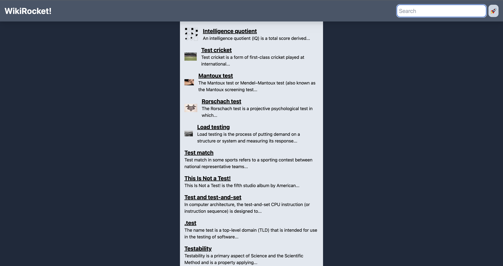

# WikiRocket 🚀

Training exercise about creating a Wikipedia SearchBar using Next.js / TypeScript and TailWind drived by Dave Gray.

Learning how Next.js works with "Route/Pages" system, and fetching data in Next.js.

## How ?

Followed Dave Gray Youtube Channel to be able to handle this project.

## Demo

## Support

For support, email frank.codingdev@gmail.com.

## Tech Stack

**Client:** Next, React, TypeScript
